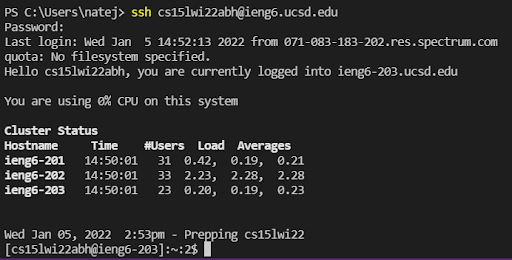
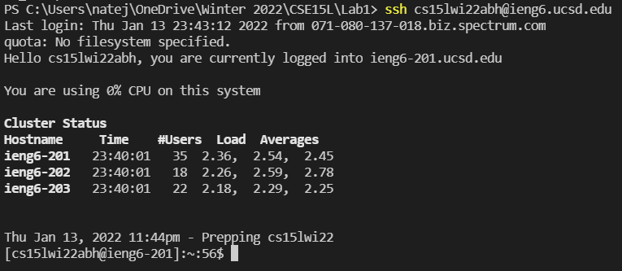
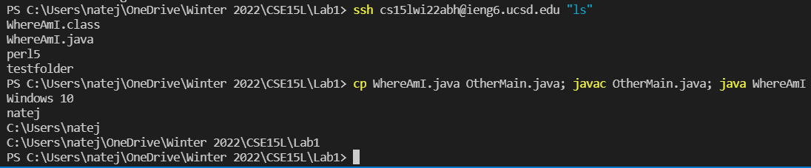

# Lab Report 1 - Logging onto ieng6 Tutorial
Back to [All Labs](https://njmorales.github.io/cse15l-lab-reports/)

## Step 1: Installing VSCode
* Download Visual Studio Code [Here](https://code.visualstudio.com/)!
* After it has installed, open the program. It should look something like this:


## Step 2: Remotely Connecting
* If you are on Windows, you must first install a program called OpenSSH. You can do that by following this guide [Here](https://docs.microsoft.com/en-us/windows-server/administration/openssh/openssh_install_firstuse)!
* Lookup your course-specific account for CSE 15L [Here](https://sdacs.ucsd.edu/~icc/index.php)
* Your account name should resemble something like this (with the 'xx' portion replaced by your specific characters): 
```
cs15lwi22xx@ieng6.ucsd.edu
```
* In VSCode, open the terminal and type this command: 
```
$ ssh cs15lwi22xx@ieng6.ucsd.edu
```
* Type 'yes' if you recieve a message along the lines of this: 
```
The authenticity of host 'ieng6.ucsd.edu (128.54.70.227)' can't be established.
RSA key fingerprint is SHA256:ksruYwhnYH+sySHnHAtLUHngrPEyZTDl/1x99wUQcec.
Are you sure you want to continue connecting (yes/no/[fingerprint])?
```

* The terminal will then ask for your account password, so type that in and hit enter. You should then see something like this in your terminal:


## Step 3: Trying Some Commands
* Now try running the commands `cd`, `ls`, `pwd`, `mkdir`, and `cp` a few times in different ways, both on your computer, and on the remote computer after ssh-ing. Experiment with what the commands can do!
* Here is what running some different commands would look like:

* To log out of the remote server in your terminal, you can use `Ctrl+D` or run the command `exit`

## Step 4: Moving Files with scp
* Using a command called `scp`, you will be able to copy files from your computer (client) to a remote computer (server)
* Create a file called `WhereAmI.java` on your computer and copy this code into it: 
```
class WhereAmI {
    public static void main(String[] args) {
        System.out.println(System.getProperty("os.name"));
        System.out.println(System.getProperty("user.name"));
        System.out.println(System.getProperty("user.home"));
        System.out.println(System.getProperty("user.dir"));
    }
}
```
* Use `javac` and `java` to run this program on your computer. It should print out the name of the operating system, the name of the user, and some directories
* Then, from the directory where you made the `WhereAmI.java` file, run this command with your username respectively:
```
scp WhereAmI.java cs15lwi22xx@ieng6.ucsd.edu:~/
```

* You will be prompted with a password to login with ssh, enter it and the file should be copied over to the remote computer. Log in to ieng6 using ssh again and run `ls`. You should now see that the file has been copied to the server. Use `javac` and `java` again to run the program on the server, it will look similar to this:


## Step 5: Setting an SSH Key
* On client (your computer) enter the commands as follows using your respective username and directories:
```
$ ssh-keygen
Generating public/private rsa key pair.
Enter file in which to save the key (/Users/joe/.ssh/id_rsa): /Users/joe/.ssh/id_rsa
Enter passphrase (empty for no passphrase): 
Enter same passphrase again: 
Your identification has been saved in /Users/joe/.ssh/id_rsa.
Your public key has been saved in /Users/joe/.ssh/id_rsa.pub.
The key fingerprint is:
SHA256:jZaZH6fI8E2I1D35hnvGeBePQ4ELOf2Ge+G0XknoXp0 joe@Joes-Mac-mini.local
The key's randomart image is:
+---[RSA 3072]----+
|                 |
|       . . + .   |
|      . . B o .  |
|     . . B * +.. |
|      o S = *.B. |
|       = = O.*.*+|
|        + * *.BE+|
|           +.+.o |
|             ..  |
+----[SHA256]-----+
```
* Then, copy the public key to the .ssh directory on the server by following these commands (with your username respectively):
```
$ ssh cs15lwi22zz@ieng6.ucsd.edu
*Enter Password*
(now on server)
$ mkdir .ssh
$ *logout*
(back on client)
$ scp /Users/joe/.ssh/id_rsa.pub cs15lwi22@ieng6.ucsd.edu:~/.ssh/authorized_keys
```

* What this has done is created public and private keys that are stored on the server and client respectively, allowing you to ssh from this client without tediously entering a password everytime. As you can see here, no password was required:


## Step 6: Optimizing Remote Running
* You can write a command in quotes at the end of an ssh command to run it on the remote server without having to login and logout. This command will log in and list the home directory on the remote server, then return you to your client directory:
```
$ ssh cs15lwi22xx@ieng6.ucsd.edu "ls"
```
* You can also use semicolons to run multiple commands on the same line:
```
$ cp WhereAmI.java OtherMain.java; javac OtherMain.java; java WhereAmI
```
* Running these commands should look something like this:

* One last handy tip! You can use the up-arrow on your keyboard to recall and cycle through previous commands!