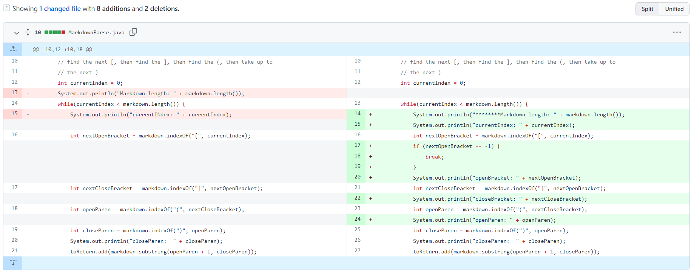
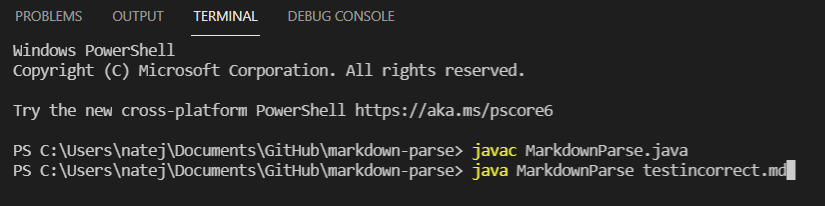
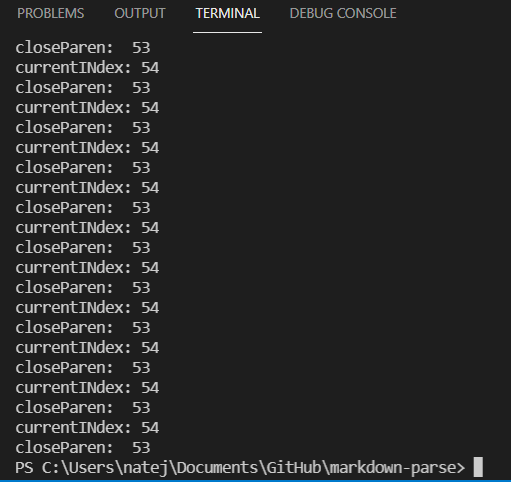
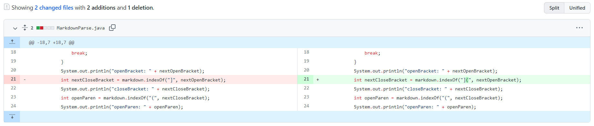
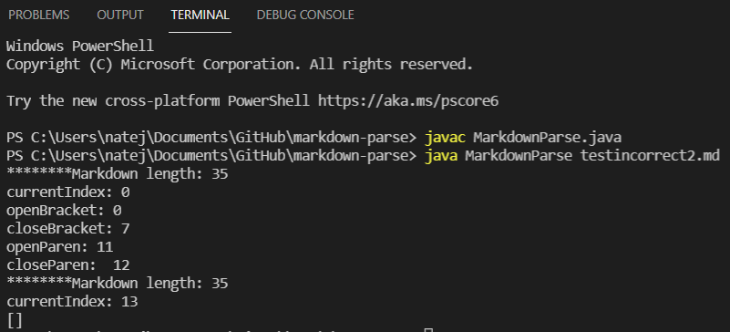
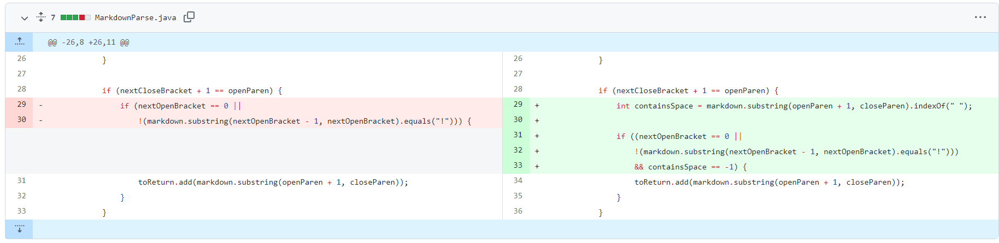
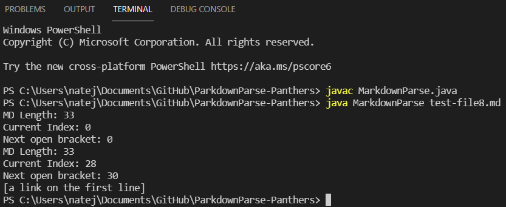

# Lab Report 2 - GitHub Changes from Weeks 3 and 4
Back to [All Labs](https://njmorales.github.io/cse15l-lab-reports/)

## Code Change 1: Fixing an infinite loop
* GitHub commit differences: 

* [Failure-inducing input file](testincorrect.md)
* Symptom input: 

* Symptom output: 

* The bug we found was that we did not check for the possibility of the nextOpenBracket having the value of -1 due to the fact that the "[" character was not found in the given substring from the markdown test file. This caused an infinite loop of reassigning variables to the same values, which we were able to detect because we inserted print statements in the code to track these values. Eventually, the code was updated to end the while loop and return if the values of any brackets or parentheses were -1. 

## Code Change 2: Fixing a syntax issue
* GitHub commit differences: 

* [Failure-inducing input file](testincorrect2.md)
* Symptom input and output: 

* The bug here was the fact that we did not account for the possibility of bracket characters being a part of the clickable text for the link. This meant that the wrong nextCloseBracket value was used in the code, causing the link to not be detected and making the outputted list empty even though we expected that link to be included in the list. To fix this temporarily, we changed the detection of "]" to the detection of"](" to ensure that the code was searching for a link within the parentheses right after the closed bracket character. 

## Code Change 3: Fixing another syntax issue
* GitHub commit differences:

* [Failure-inducing input file](test-file8.md)
* Symptom input and output: 

* We found another syntax related bug here, where we didn't account for the possibility of spaces being included in the clickable text. This caused the text to be included in the outputted list (which we expected to be empty) though it was not in the correct format of a link, as links do not contain spaces. We added a new condition to the if-statement that determines whether the link should be added to the list to ensure that the link did not include any spaces. 