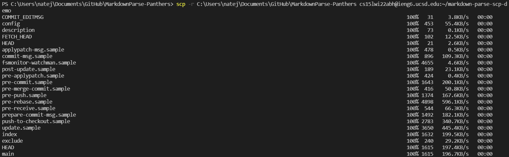
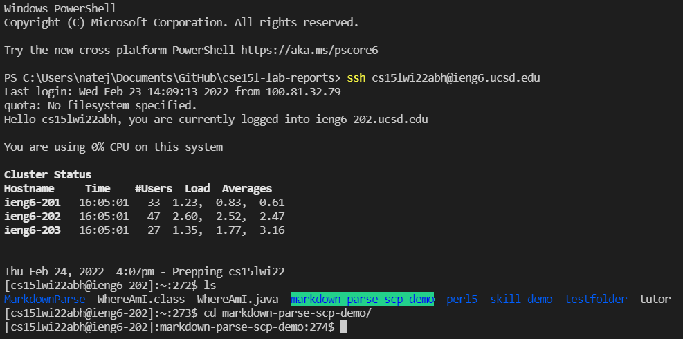
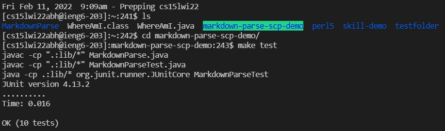
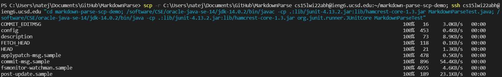
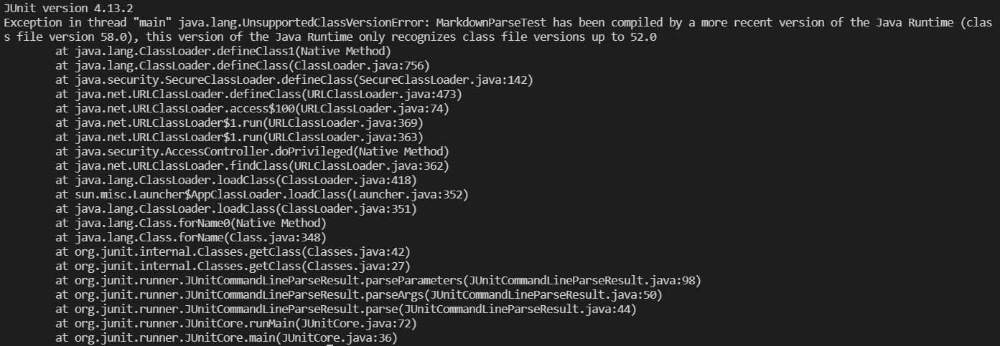

# Lab Report 4 - Addressing Markdown Snippets
Back to [All Labs](https://njmorales.github.io/cse15l-lab-reports/)

## 1. Copying the whole MarkdownParse directory to my ieng6 account
* Screenshot of command and some of the terminal output:  

* I used the `scp.java -r` command to copy my MarkdownParse directory into a file called "markdown-parse-scp-demo" on my ieng6 account. 

## 2. Compiling and running the copied code
* Screenshot of logging into ieng6 to check everything copied correctly:  

* As you can see here after logging into my remote account, the code from my MarkdownParse directory successfully copied into my ieng6 account under the file "markdown-parse-scp-demo".

* Screenshot of remote test output:  

* I then ran the command `make test` to compile and run the MarkdownParseTest class using the `makefile` that we created in the week 6 lab. The output shows that the tests compiled and ran successfully. 

## 3. Combining commands to copy the directory and run the tests in one line
* Screenshot of the one-line command:  

* Screenshot of the output (unexpected error):

* I utilized the same commands from the week 4 lab to attempt to copy the directory and run the tests in one line. Though these commands work separately, for some reason when ran together in one line they do not work and I receive a message about a Java Runtime version mismatch between my code and the ieng6 compiler. I also tried to use the `make test` command as well and received the same result. I am not sure if this is a problem on my end, as my code compiles and runs correctly when I `scp`, `ssh`, and run the tests separately. 
