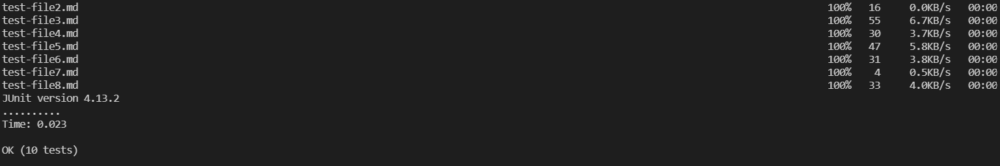

# Lab Report 3 - Copying a Whole Directory with scp -r
Back to [All Labs](https://njmorales.github.io/cse15l-lab-reports/)

## 1. Copying the whole MarkdownParse directory to my ieng6 account
* Screenshot of command and some of the terminal output:  

* I used the `scp.java -r` command to copy my MarkdownParse directory into a file called "markdown-parse-scp-demo" on my ieng6 account. 

## 2. Compiling and running the copied code
* Screenshot of logging into ieng6 to check everything copied correctly:  

* As you can see here after logging into my remote account, the code from my MarkdownParse directory successfully copied into my ieng6 account under the file "markdown-parse-scp-demo".

* Screenshot of remote test output:  

* I then ran the command `make test` to compile and run the MarkdownParseTest class using the `makefile` that we created in the week 6 lab. The output shows that the tests compiled and ran successfully. 

## 3. Combining commands to copy the directory and run the tests in one line
* Screenshot of the one-line command:  

* Screenshot of the successful output:

* As you can see here I used a combination of `scp` and `ssh` commands alongside `;` to successfully copy the whole MarkdownParse directory and run the tests contained in `MarkdownParseTest.java` all in one line in the terminal. All of the tests passed after the run. 