# Lab Report 3 - Copying a Whole Directory with scp -r
Back to [All Labs](https://njmorales.github.io/cse15l-lab-reports/)

My markdown-parse repository: (https://github.com/njmorales/markdown-parse)

Other group's markdown-parse repository: (https://github.com/P2fryang/markdown-parse)

## Test Setups
* Screenshot of the setup for the tests in my implementation:  

* Screenshot of the setup for the tests in their implementation:  
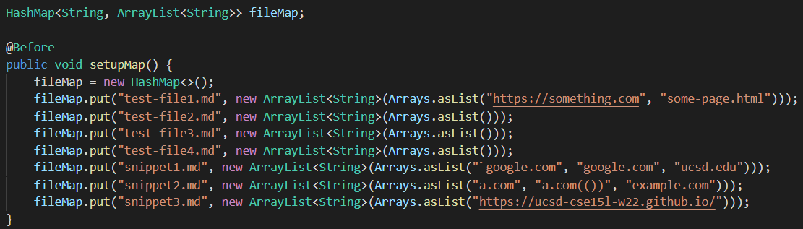

* I essentially used the same setup to implement both tests. Using a HashMap allows me to map each file name as a key to the expected output for that file, which can then be compared to the actual output once the MarkdownParse.java file is ran with a command line argument. 

## Snippet 1
* Screenshot of my snippet 1 test:  
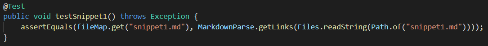

* Screenshot of my fail output:  
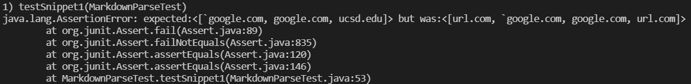

* EXPLANATION HERE

* Screenshot of their snippet 1 test:  
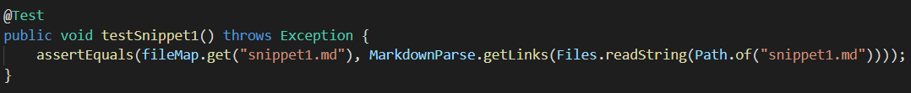

* Screenshot of their fail output:  
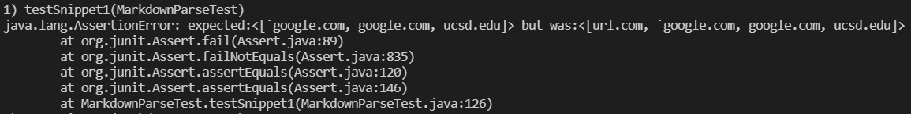

## Snippet 2
* Screenshot of my snippet 2 test:  
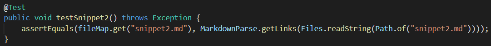

* Screenshot of my fail output:  
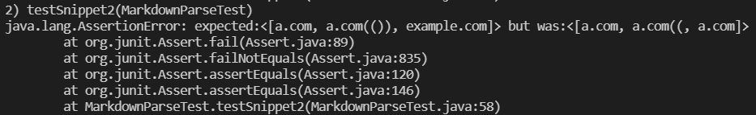

* EXPLANATION HERE

* Screenshot of their snippet 2 test:  
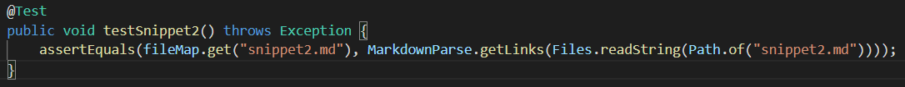

* Screenshot of their fail output:  
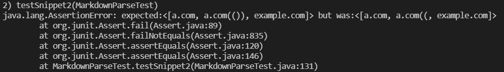

## Snippet 3
* Screenshot of my snippet 3 test:  

* Screenshot of my fail output:  
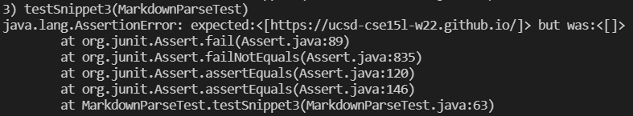

* EXPLANATION HERE

* Screenshot of their snippet 3 test:  

* Screenshot of their fail output:  
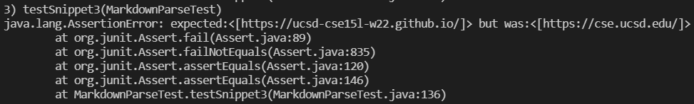