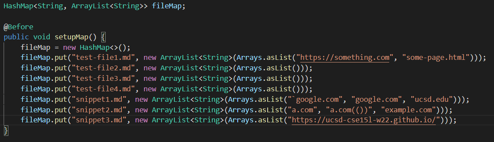

# Lab Report 4 - Addressing Markdown Snippets
Back to [All Labs](https://njmorales.github.io/cse15l-lab-reports/)

[My markdown-parse repository](https://github.com/njmorales/markdown-parse)

[Other group's markdown-parse repository](https://github.com/P2fryang/markdown-parse)

## Test Setups
* Screenshot of the setup for the tests in my implementation:  

* Screenshot of the setup for the tests in their implementation:  

* I essentially used the same setup to implement both tests. Using a HashMap allows me to map each file name as a key to the expected output for that file, which can then be compared to the actual output once the `MarkdownParse.java` file is ran with a command line argument. 

## Snippet 1
* Screenshot of my snippet 1 test:  

* Screenshot of my fail output:  

* I think there is a small code change that will allow my program to work with backticks. We would have to compare the indices of the backticks to the beginning and end indices of the corresponding link text in order to make sure that there is an even number of backticks inside and outside the brackets. This will allow for inline code to contain links inside a markdown file without disrupting the format. 

* Screenshot of their snippet 1 test:  

* Screenshot of their fail output:  

## Snippet 2
* Screenshot of my snippet 2 test:  

* Screenshot of my fail output:  

* I don't think there is a small code change that would make my program work with all cases of nested parentheses, brackets, and escaped brackets. In order to make my program work for these cases I would likely have to create a new method (or multiple methods) that would ensure that each open bracket/parenthesis is matched with a corresponding closed bracket/parenthesis later in the file. These methods would likely contain several if-statements and while loops, which would make for a more complex solution to the problem at hand. 

* Screenshot of their snippet 2 test:  

* Screenshot of their fail output:  

## Snippet 3
* Screenshot of my snippet 3 test:  

* Screenshot of my fail output:  

* I do think there is a small code change that would allow my program to work for cases with newlines within brackets. I would have to add a simple if-statement that checks that there is no more than one newline ("\n") contained within the brackets and/or parentheses. To do this I would use the `indexOf` method to check for instances of "\n" and count the instances, breaking the loop if there is more than one instance within a particular set of brackets or parentheses. 

* Screenshot of their snippet 3 test:  

* Screenshot of their fail output:  
