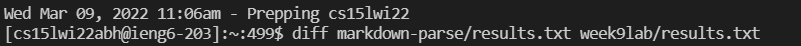
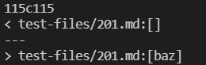
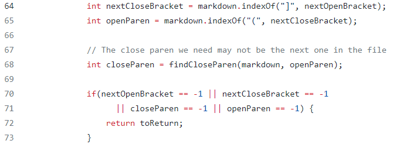
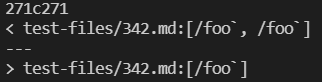
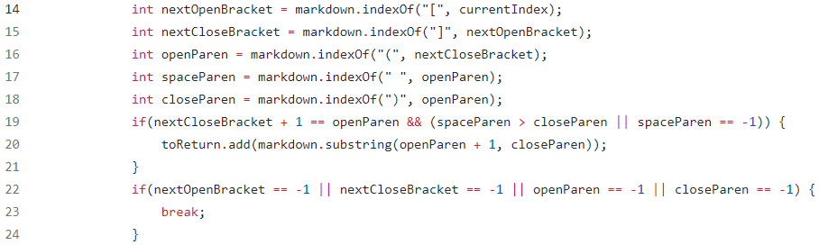

# Lab Report 5 - Comparing Output and Identifying Bugs
Back to [All Labs](https://njmorales.github.io/cse15l-lab-reports/)

[My markdown-parse repository](https://github.com/njmorales/markdown-parse)

[Provided repository from lab 9](https://github.com/ucsd-cse15l-w22/markdown-parse)

## Method For Identifying Different Results
* Screenshot of the command I used:  

* I essentially followed the instructions outlined in lab 9 to identify the different outputs between my code and the provided code. First I ran a bash command utilizing the provided `sript.sh` file on each implementation and stored the results in their respective `results.txt` files. I then ran the `diff` command on the two files to obtain a list of differences in output between the files. 

## Difference 1
* Screenshot of differences in output for `201.md` test file:  

* As seen here, line 115 of the `results.txt` file in my implementation contained an empty list while line 115 of the other implementation results contained a list with the supposed link "baz". 

* According to the [CommonMark demo site](https://spec.commonmark.org/dingus/), the expected output for [this specific test file](https://github.com/ucsd-cse15l-w22/markdown-parse/blob/main/test-files/201.md) should be an empty list, as no valid links were detected. This means that my implementation contained the correct output while the provided implementation did not. 

* Screenshot of code that must be changed in the provided implementation:  

* The bug in the provided implementation is the fact that there is no check that the open parenthesis is located at the index right after the index of the closed bracket. This means that the `:` character found in the test file would have no effect on the output even though it should prevent the detection of a link. 

## Difference 2
* Screenshot of differences in output for `342.md` test file:  

* As seen here, line 271 of the `results.txt` file in my implementation contained a list with two supposed links while line 271 of the other implementation results contained a list with one supposed link.

* According to the [CommonMark demo site](https://spec.commonmark.org/dingus/), the expected output for [this specific test file](https://github.com/ucsd-cse15l-w22/markdown-parse/blob/main/test-files/342.md) should be an empty list, as no valid links were detected. This means that both my implementation and the provided implementation did not contain the correct expected output. 

* Screenshot of code that must be changed in my implementation:  

* Overlapping backticks are what cause the error in my implementation. I would have to compare the indices of the backticks to the beginning and end indices of the corresponding link text and actual link in order to make sure that there is an even number of backticks inside and outside the brackets and parentheses. If the matching backticks overlap between the parentheses and the brackets, then a link should not be added to the output list. 